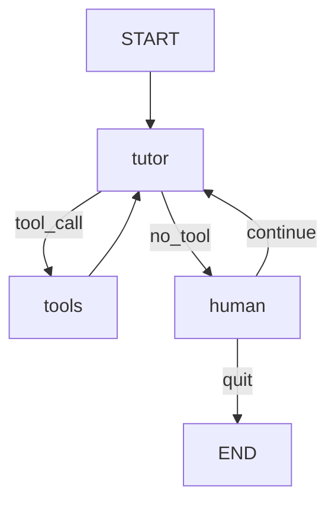

**Introduction**
First, thanks to 5 days course from Kaggle and Google. This post is to introduce how I build the project, Build-Your-Tutor.

Have you ever found yourself endlessly searching for the same issue, trying different keywords, reading article after article, but still not finding the answer? I’ve been there too. Sometimes, I’m not even sure why the problem is happening in the first place. But I’ve come to realize that part of the challenge lies in how we each perceive the world. Everyone has a unique way of learning and understanding things—which means explanations that make perfect sense to one person might completely miss the mark for someone else.
If we had an agent that could translate information into the way we understand it, learning could become more efficient than ever before.

**Atoms**
- HumanAgent: It handles data flow of the users.
- TutorAgent: Our customized tutor who fits the most of the users' learning path.
- ExpertAgent: Give lessons to the tutor for the domain knowledge. The expert will search from WiKi Page for knowledge to float to the top.

**Work Flow**



Tools have 2 functions:
1. Ask the expert for help 
2. Write the summary to a blog with your style


## 1. Defining the State

```python
class LearningState(TypedDict):
    messages: Annotated[list, add_messages]
    topic: list[str]
    learning_style: str
    learned: bool
    finished: bool
```

Tracks all information in the conversation:
- `messages`: full conversation history
- `topic`: user-specified learning topics
- `learning_style`: user's preferred learning style
- `learned`: whether tutor has learned from expert
- `finished`: whether session is over

---


## 2. Human Node

### `human_node`

Receives user input and updates state:
```python
def human_node(state: LearningState) -> LearningState:
```

### `maybe_exit_human_node`

Decides whether to exit or return to tutor:
```python
def maybe_exit_human_node(state: LearningState) -> Literal["tutor", "__end__"]:
```

---

## 3. Tools: Expert QA + Blogging

### a. Expert Tool

```python
@tool(args_schema=AskExpertInput)
def ask_expert(topic: str, question: str) -> str:
```

Fetches topic info from Wikipedia and uses Gemini to return an expert response.

### b. Blog Writing Tool

```python
@tool
def blog_it() -> str:
```

Formats conversation into blog post using user's writing style.

---

## 4. Tutor Node with Tools

### `tutor_with_tools(state)`

1. If no messages: greet with welcome message
2. If `learning_style` not set: request it and ask for topic
3. If `learned` is True: generate answer
4. If tools needed: invoke them, follow up with LLM using responses

```python
def maybe_route_to_tools(state: LearningState) -> Literal["tools", "human"]:
```
Decides whether to invoke tool or route to user.

---

## 5. Building LangGraph

Adds all nodes:
```python
graph_builder.add_node("tutor", tutor_with_tools)
graph_builder.add_node("human", human_node)
graph_builder.add_node("tools", tool_node)
```

Adds all routing logic:
```python
graph_builder.add_conditional_edges(...)
graph_builder.add_edge(...)
```

Compiles graph and visualizes it.

---


## Final Takeaway

This modular, tool-augmented tutor framework is designed for:
- Personalized learning
- Optional expert augmentation
- Auto-blogging
- Flexible state-based conversation routing

TODO List:
- Pre-exam and post-exam to compare learn from your tutor and learn from the model.
- Data collection and finetuning your tutor.

## Murmur
- Langchain updates too quick for the model to catch up. Searching tool for AI doesn't help too much at this point.


## Example of Output Note

```
# Building Your First Clothing Recommendation System: A Top-Down Approach

**Introduction**

Recommendation systems are a powerful tool for personalizing the online shopping experience and driving sales. In this guide, we'll explore how to build a clothing recommendation system using a top-down approach, starting with the big picture and gradually diving into the technical details.

**Phase 1: Understanding the Landscape**

-   **What are recommendation systems?** Systems designed to predict user preferences and suggest items they might like.
-   **Why are they important?** Increase sales, improve user experience, personalize shopping.
-   **Types of Recommendation Systems:**
    -   Content-based: Recommends similar items.
    -   Collaborative filtering: Recommends items liked by similar users.
    -   Hybrid: Combines content-based and collaborative filtering.

**Phase 2: Clothing-Specific Considerations**

-   **Fashion Trends:** Adapt to rapidly changing styles.
-   **Visual Similarity:** Leverage image-based recommendations.
-   **Size and Fit:** Handle variations across brands.
-   **Occasion and Style:** Recommend outfits based on lifestyle.
-   **Data Sources:** Purchase history, browsing history, user profiles, product attributes, reviews, social media.

**Phase 3: System Design for Scalability and Personalization**

-   **High-Level Architecture:** Data collection, data processing, model training, recommendation engine, API gateway, caching layer.
-   **Scaling for High Traffic:**
    -   Horizontal scaling (load balancing, auto-scaling, containerization).
    -   Caching strategies (CDN, in-memory caches).
    -   Database optimization (read replicas, sharding).
    -   Asynchronous processing (message queues).
-   **Personalization Strategies:**
    -   User segmentation (clustering, personas).
    -   Contextual personalization (real-time data, session-based recommendations).
    -   Personalized ranking (learning to rank, re-ranking).
    -   Explainable recommendations.
    -   A/B testing and optimization.
    -   Feedback loops.

**Phase 4: Building a Simple Recommendation System (The "Basic Boutique Recommender")**

-   **Core Components:**
    -   **Product Catalog (Database):** Stores product information.
    -   **User Interactions (Database):** Tracks user behavior.
    -   **Recommendation Engine (Service):** Implements collaborative filtering.
    -   **Web Application (Service):** Displays recommendations.
-   **Data Flow:** User views product -> Web App requests recommendations -> Recommendation Engine retrieves recommendations -> Web App displays recommendations -> User interaction logged.
-   **Algorithm:** Item-based collaborative filtering (pre-compute similarity scores).
-   **Scalability Considerations (from the start):**
    -   Caching (API responses in the web app).
    -   Asynchronous data processing (logging user interactions).
    -   Stateless Recommendation Engine (for horizontal scaling).
    -   Database optimization (indexes).
-   **Simple Personalization:**
    -   Popular items for new users.
    -   Category-based recommendations.
*   **Technologies:** Python, Flask/FastAPI, PostgreSQL/MySQL, Redis (optional).

**Trade-offs to Consider:**

*   Accuracy vs. Latency
*   Personalization vs. Scalability
*   Cold Start Problem
*   Data Privacy
*   Bias and Fairness

**Conclusion:**

Building a recommendation system is an iterative process. Start with a simple system, test it thoroughly, and gradually add complexity as your knowledge and experience grow. By following this top-down approach, you'll be well-equipped to create a personalized and engaging shopping experience for your users.
```

@misc{gen-ai-intensive-course-capstone-2025q1,
    author = {Addison Howard and Brenda Flynn and Myles O'Neill and Nate and Polong Lin},
    title = {Gen AI Intensive Course Capstone 2025Q1},
    year = {2025},
    howpublished = {\url{https://kaggle.com/competitions/gen-ai-intensive-course-capstone-2025q1}},
    note = {Kaggle}
}